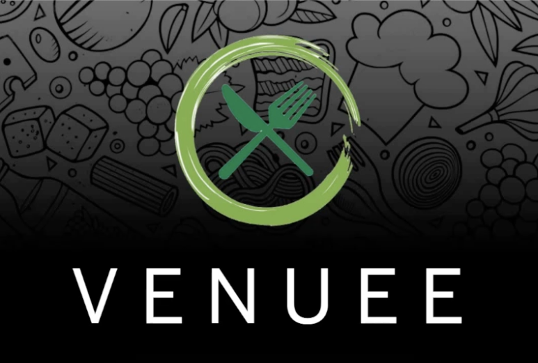

# Venuee

A web application that helps users easily find and book local event spaces based on desired date and party size.



## API Endpoints

| API                                                  | Method  | Endpoint                           |  Status |
| :--------------------------------------------------- | :------ | :--------------------------------- | ------: |
| 📝 Users                                             |
| [Register User](#registerUser)                       | POST    | /user/register                     |     201 |
| [User Login](#userLogin)                             | POST    | /user/login                        |     200 |
| [Get User Profile](#getUser)                          | GET     | /user/find                          |     200 |
| [Delete User Profile](#deleteUser)                    | DELETE  | /user/find                          |     204 |
| 🧑‍🏫 Vendors                                           |
| [Register Vendor](#registerVendor)                   | POST    | /vendor/register                   |     201 |
| [Vendor Login](#vendorLogin)                         | POST    | /vendor/login                      |     200 |
| [Get Vendor Profile](#getVendorProfile)                | GET     | /vendor/find                        |     200 |
| [Get Vendor By Name](#getVendorByName)               | POST    | /vendor/name                       |     200 |
| [Get Available Vendors](#getAvailableVendors)        | GET     | /vendor/availability               |     200 |
| 🙋‍♀️ Reservations                                      |
| [Create User Reservation](#createUserReservation)    | POST    | /reservation/                      |     200 |
| [Create Vendor Reservation](#createVendorReservation)| POST    | /reservation/unavailable           |     200 |
| [Get A User's Reservations](#getUserReservations)    | GET     | /reservation/user                  |     200 |
| [Get A Vendor's Reservatiosn](#getVendorReservations)| GET     | /reservation/vendor                |     200 |
| [Delete Reservation](#deleteReservationById)         | DELETE  | /reservation/delete/:id            |     200 |


  
## Used Tech Stack
  
### Frontend
- React Framework
- CSS for styling

### Backend
- Node.js with Express.js for the Server
- JWT for authentication
- Postgresql and Sequelize as the Database

## Getting Started

### Frontend
- Have Node.js installed on your machine
- Following the example in .env.example, add your credentials to the .env file
- To start the frontend, change directory into client folder and run:
```npm install```
- After dependencies have been installed, start the client:
```npm start```
### Backend
- To start, change directory into server folder
- Following the example in .env.example, add your credentials to your .env file
- To start the frontend run:
```npm install```
- Run the seed file to populate the database with filler data:
```node seed```
- Start server
```nodemon --> starts the node express server```
## Database
- you can change the sync.force property in the server's index.js:
When 'false', the 'nodemon' command will add the seed data to data already existing in the database.
When 'true', the 'nodemon' command will delete everything in the database, and then add the seed data to the empty database.


### Credit
Venuee was built by Ammar Khomusi, Nicolás Ogno Aguad, Tyler Wells, Mike Kaib, and Ash Mudra
